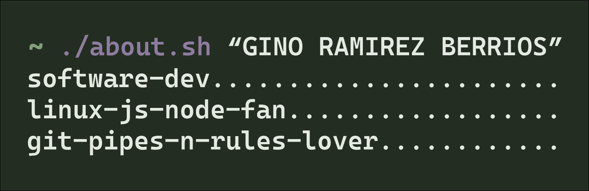

# Hola Mundo, soy Gino Ramírez 👋👨‍💻

### Head of Agentic Engineering @ [Nubox](https://www.nubox.com) · Santiago, Chile 🇨🇱

Desarrollador de software apasionado por construir productos que escalan y por
explorar cómo los **agentes de IA** transforman la forma en que creamos software.
Disfruto trabajar con **Angular**, **Jamstack** (JavaScript, APIs, Markup) y
bases de datos **SQL/NoSQL**.

Actualmente lidero **Agentic Engineering** en [@nubox-spa](https://github.com/nubox-spa).
Antes aporté mi granito de arena en **Canal 13**, **Puntoticket**,
**Servicio de Impuestos Internos (SII)**, **BBVA**, entre otros.

---

## 🛠️ Tecnologías que disfruto

---

## 🚀 En qué ando

- 🤖 Liderando **Agentic Engineering**: agentes de IA aplicados al desarrollo de software.
- 🧩 Construyendo experiencias web con **Angular** y arquitecturas **Jamstack**.
- 📈 Escalando productos en el ecosistema fintech/SaaS de **Nubox**.
- 🧠 Aprendiendo y compartiendo: me gusta escribir y conversar sobre tecnología.

---

## 📊 GitHub Stats

---

## 🌐 Dónde encontrarme

---

> 💬 *"Construyamos software que valga la pena, con o sin agentes de por medio."*
